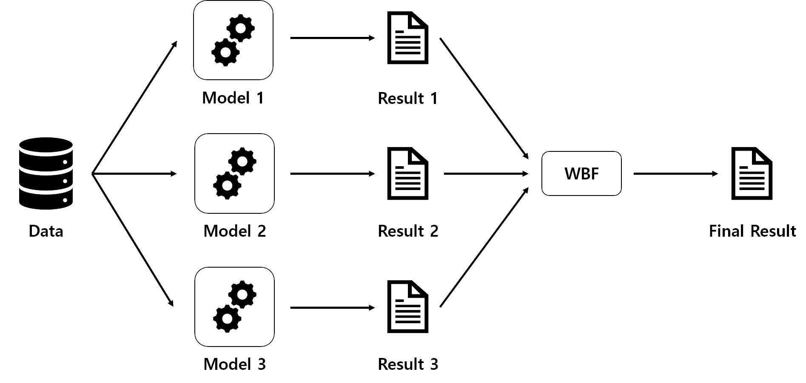

# EnsembleObjectDetector

## Introduction

Ensemble object detector using
[Weighted Boxes Fusion (WBF)](https://arxiv.org/pdf/1910.13302.pdf) algorithm.



## Dependencies

- [PyTorch](https://pytorch.org/)==1.9.0
- [MMDetection](https://github.com/open-mmlab/mmdetection)==2.11.0
- [MMCV](https://github.com/open-mmlab/mmcv)==1.3.11
- [ensemble-boxes](https://github.com/ZFTurbo/Weighted-Boxes-Fusion)==1.0.6

## Usage

```bash
python main.py [--device DEVICE] [--coco_config COCO_CONFIG] [--model_config MODEL_CONFIG [MODEL_CONFIG ...]] [--model_checkpoint MODEL_CHECKPOINT [MODEL_CHECKPOINT ...]] [--model_output MODEL_OUTPUT [MODEL_OUTPUT ...]]
```

```text
optional arguments:
  --device DEVICE       Device type
  --coco_config COCO_CONFIG
                        Path of the coco detection config
  --model_config MODEL_CONFIG [MODEL_CONFIG ...]
                        List of the path of model configs
  --model_checkpoint MODEL_CHECKPOINT [MODEL_CHECKPOINT ...]
                        List of the path of model checkpoints
  --model_output MODEL_OUTPUT [MODEL_OUTPUT ...]
                        List of the path of model outputs
```

## Test Example

The object detection models that I used for the test are listed below.

| Name                                                   | Backbone | Lr schd | GN  |                                                                    Model FIle                                                                     |                                       Source                                       |
| ------------------------------------------------------ | :------: | :-----: | :-: | :-----------------------------------------------------------------------------------------------------------------------------------------------: | :--------------------------------------------------------------------------------: |
| [Faster-RCNN](https://arxiv.org/pdf/1506.01497.pdf)    | R-50-FPN |   1x    |     | [Link](https://download.openmmlab.com/mmdetection/v2.0/faster_rcnn/faster_rcnn_r50_fpn_1x_coco/faster_rcnn_r50_fpn_1x_coco_20200130-047c8118.pth) | [Link](https://github.com/open-mmlab/mmdetection/tree/v2.11.0/configs/faster_rcnn) |
| [RetinaNet](https://arxiv.org/pdf/1708.02002.pdf)      | R-50-FPN |   1x    |     |    [Link](https://download.openmmlab.com/mmdetection/v2.0/retinanet/retinanet_r50_fpn_1x_coco/retinanet_r50_fpn_1x_coco_20200130-c2398f9e.pth)    |  [Link](https://github.com/open-mmlab/mmdetection/tree/v2.11.0/configs/retinanet)  |
| [SABL RetinaNet](https://arxiv.org/pdf/1912.04260.pdf) | R-50-FPN |   1x    |  N  |      [Link](http://download.openmmlab.com/mmdetection/v2.0/sabl/sabl_retinanet_r50_fpn_1x_coco/sabl_retinanet_r50_fpn_1x_coco-6c54fd4f.pth)       |    [Link](https://github.com/open-mmlab/mmdetection/tree/v2.11.0/configs/sabl)     |

The dataset that I used for the test is
[COCO Val Images 2017](https://cocodataset.org/#download).

To test my project,

1. Download model files. Place them inside the 'checkpoints' directory.
2. Download COCO annotations and images. Place them inside the
   'data/coco/annotations' and 'data/coco/val2017' directory, respectively.
3. Make 'outputs' directory. Output results will be saved in this directory as
   'pkl' format.
4. Run 'python main.py'

For easy to understand, contents of my project directory are as follows:

```text
.
├── README.md
├── checkpoints
│   ├── faster_rcnn_r50_fpn_1x_coco_20200130-047c8118.pth
│   ├── retinanet_r50_fpn_1x_coco_20200130-c2398f9e.pth
│   └── sabl_retinanet_r50_fpn_1x_coco-6c54fd4f.pth
├── configs
├── data
│   └── coco
│       ├── annotations
│       │   └── instances_val2017.json
│       └── val2017
│           ├── 000000000139.jpg
│           ├── 000000000285.jpg
│           └── ...
├── dataset.py
├── detector.py
├── image
├── main.py
├── outputs
│   ├── faster_rcnn_r50_fpn_1x_coco.pkl
│   ├── retinanet_r50_fpn_1x_coco.pkl
│   └── sabl_retinanet_r50_fpn_1x_coco.pkl
└── requirements.txt
```

After run the program, you can get the following Box AP results at
IoU=0.50:0.95, area=all.

| Faster-RCNN | RetinaNet | SABL RetinaNet | Ensemble (Proposed) |
| :---------: | :-------: | :------------: | :-----------------: |
|    37.4     |   36.5    |      37.8      |      **40.2**       |
